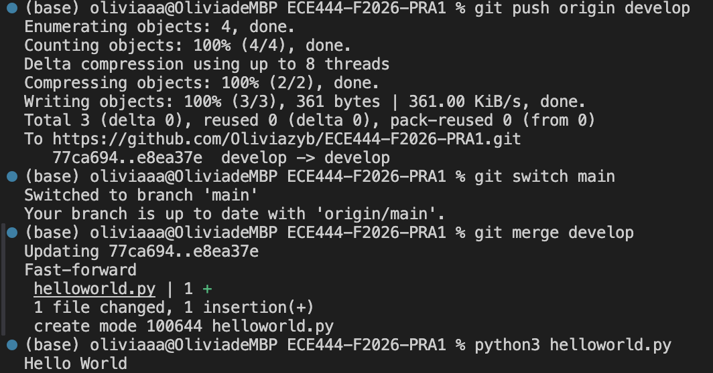
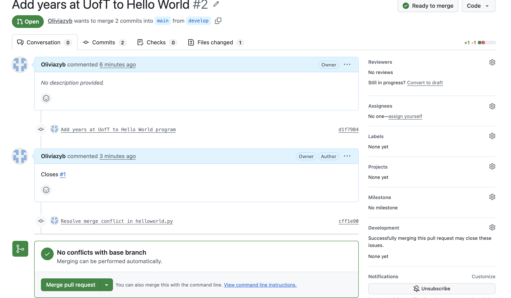
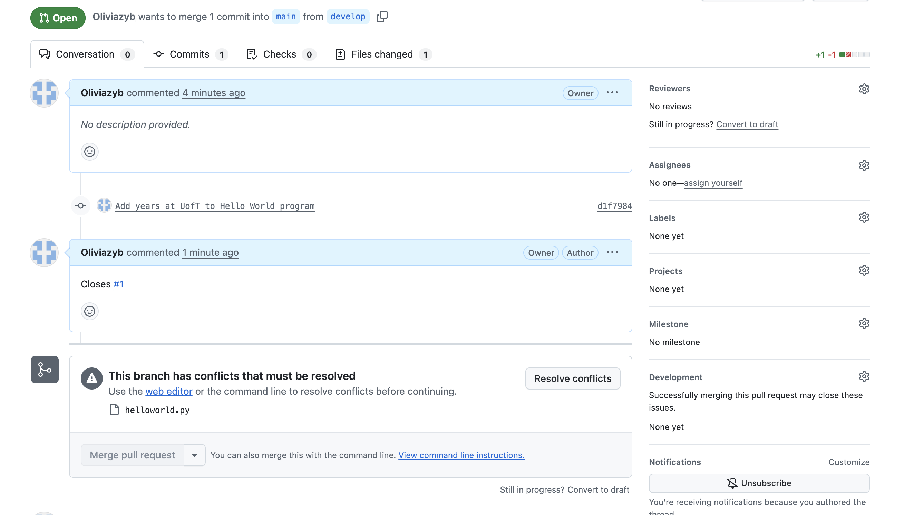
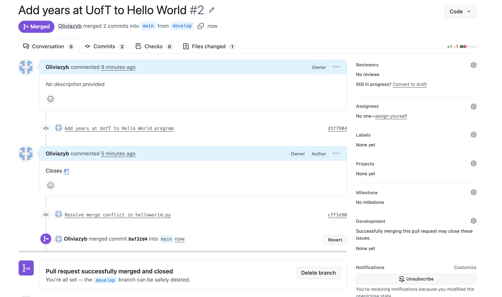
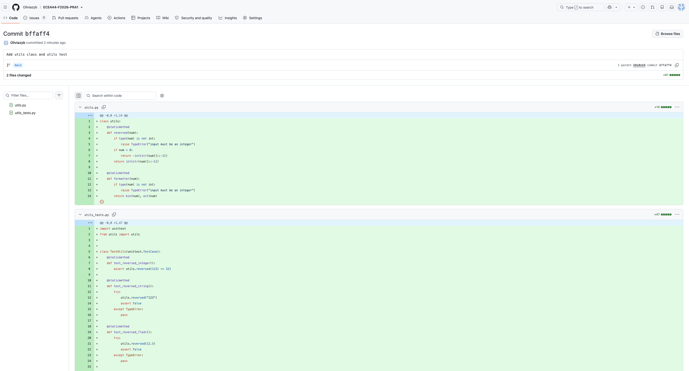
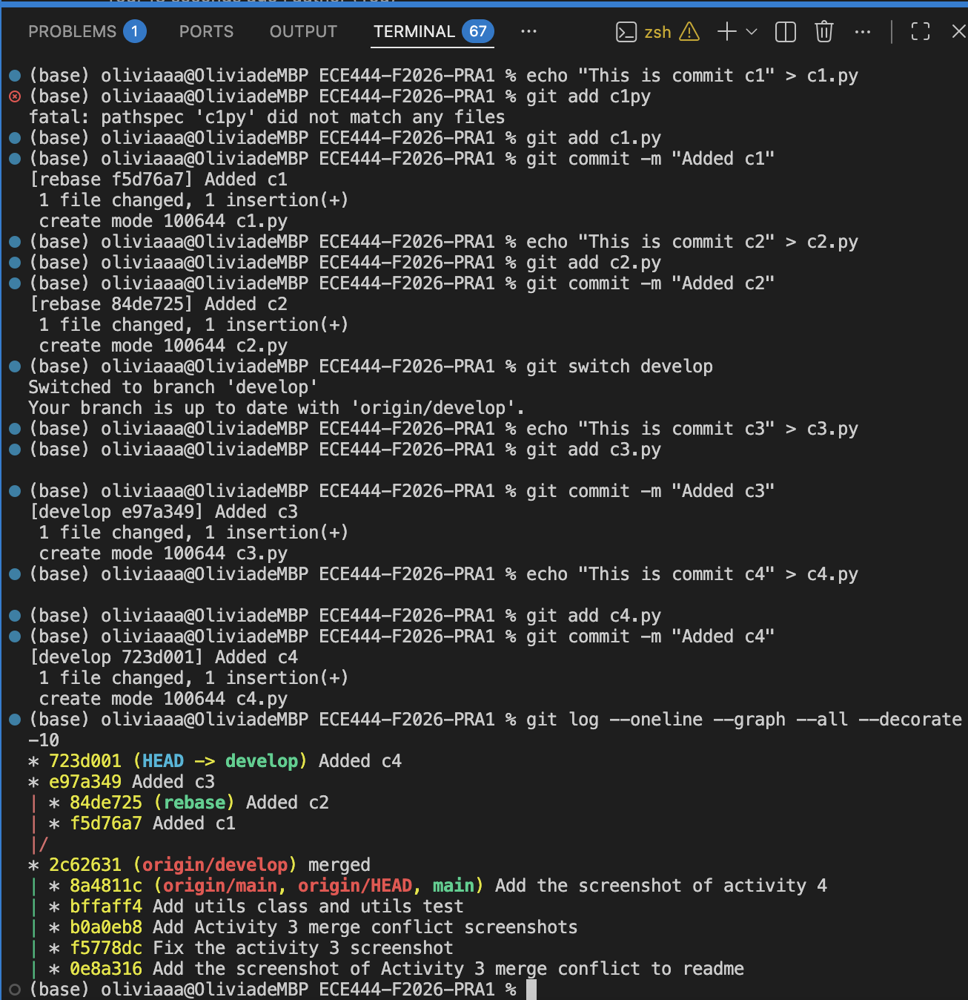
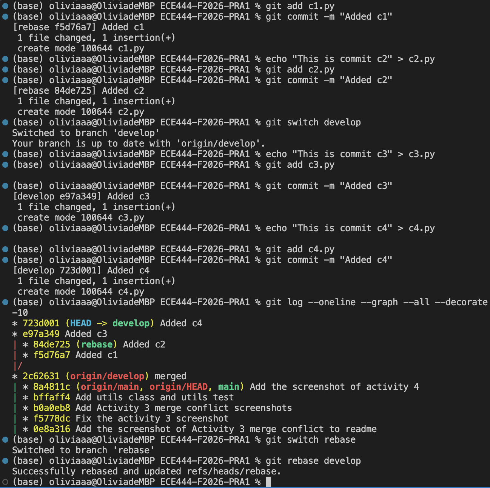
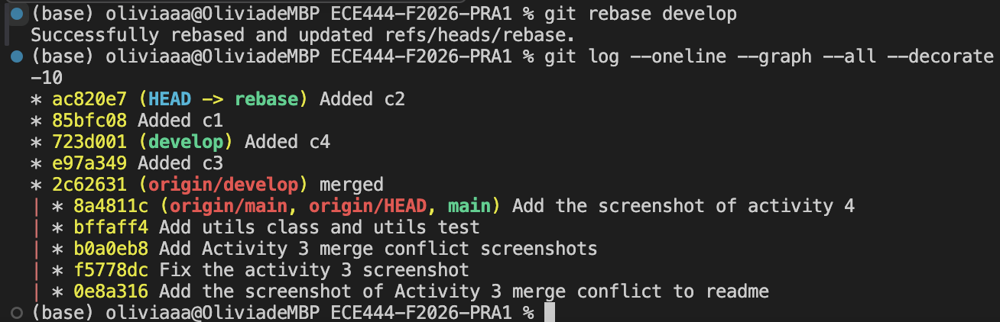

# Olivia Zhang

## Activity 1: Screenshot of commit

## Activity 2: Screenshot of merge branch

## Activity 3: Screenshots of merge conflict
### Before Merge PR

### Merging PR

### Successfully Merge PR

## Activity 4: Screenshot of unit test commit

## Activity 5: Screenshot of rebase
### Before Rebase

### Rebase

### After Rebase
